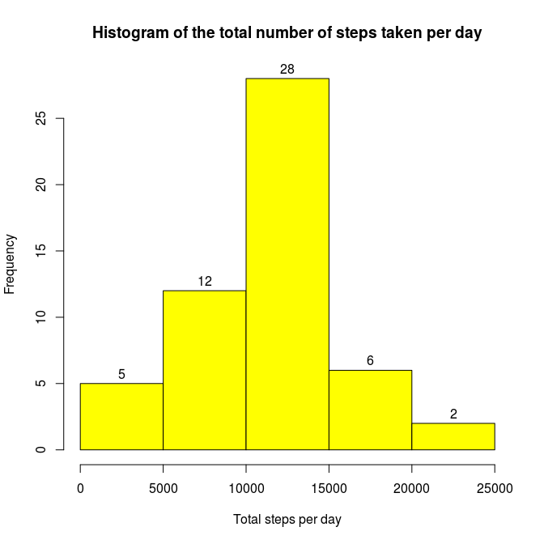
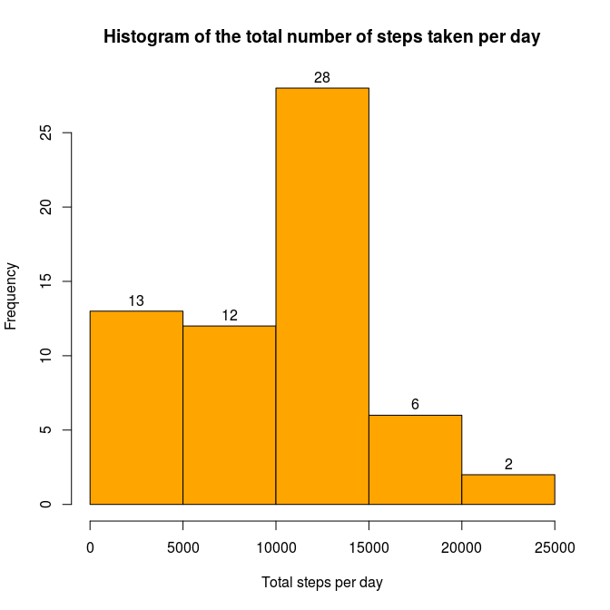

# Reproducible Research: Peer Assessment 1


## Loading and preprocessing the data


```r
## read from a connection to zip file
activity <- read.csv(unz(description = "activity.zip", filename = "activity.csv"), na.strings = "NA")
str(activity)
```

```
## 'data.frame':	17568 obs. of  3 variables:
##  $ steps   : int  NA NA NA NA NA NA NA NA NA NA ...
##  $ date    : Factor w/ 61 levels "2012-10-01","2012-10-02",..: 1 1 1 1 1 1 1 1 1 1 ...
##  $ interval: int  0 5 10 15 20 25 30 35 40 45 ...
```


## What is mean total number of steps taken per day?

For this part of the assignment, you can ignore the missing values in the dataset.

```r
## index of valid rows (no NA)
ok_rows <- complete.cases(activity)
act <- activity[ok_rows, ]
```

1. Calculate the total number of steps taken per day

```r
dsteps <- aggregate(steps ~ date, data = act, FUN = sum )
colnames(dsteps)[2] <- "SUM"
```

2. If you do not understand the difference between a histogram and a barplot, research the difference between them.

```r
barplot(height = dsteps$SUM, names.arg = dsteps$date, main = "Barplot of the total number of steps taken per day", xlab = "Date", ylab = "Steps per day")
```

 

Make a histogram of the total number of steps taken each day

```r
hist(dsteps$SUM, main = "Histogram of the total number of steps taken per day", xlab = "Total steps per day", labels = TRUE, col = "yellow")
```

 

3. Calculate and report the mean and median of the total number of steps taken per day

```r
mean1 <- mean(dsteps$SUM)
median1 <- median(dsteps$SUM)
MEAN1 <- as.character(round(mean1, 2))
MEDIAN1 <- as.character(round(median1, 2))
```
- Mean of the total number of steps per day: 10766.19
- Median of the total number of steps per day: 10765


## What is the average daily activity pattern?

1. Make a time series plot (i.e. type = "l") of the 5-minute interval (x-axis) and the average number of steps taken, averaged across all days (y-axis)

```r
act <- transform(act, interval=factor(interval))
avgsteps <- aggregate(steps ~ interval, act, FUN = mean )
plot(x = avgsteps$interval, y = avgsteps$steps, type = "l", main = "Average number of steps, across all days", ylab = "mean steps" )
lines(avgsteps)
```

 

2. Which 5-minute interval, on average across all the days in the dataset, contains the maximum number of steps?

```r
maxstepsinterval <- levels(avgsteps$interval)[which.max(avgsteps$steps)]
```
- Interval that contains the maximum number of steps: 835


## Imputing missing values

1. Calculate and report the total number of missing values in the dataset (i.e. the total number of rows with NAs)

```r
missingvalues <- sum(is.na(activity$steps))
```
- Total number of missing values: 2304

My strategy for the missing values in the dataset is filling in with zeroes

```r
act2 <- activity
act2[is.na(act2)] <- 0
```

Histogram of the total number of steps taken each day with NA values replaced with zeroes

```r
dsteps2 <- aggregate(steps ~ date, data = act2, FUN = sum )
colnames(dsteps2)[2] <- "SUM"
hist(dsteps2$SUM, main = "Histogram of the total number of steps taken per day", xlab = "Total steps per day", labels = TRUE, col = "orange")
```

 


```r
mean2 <- mean(dsteps2$SUM)
median2 <- median(dsteps2$SUM)
MEAN2 <- as.character(round(mean2, 2))
MEDIAN2 <- as.character(round(median2, 2))
```
- Mean of the total number of steps per day: 9354.23
- Median of the total number of steps per day: 10395


```r
meandiff <- mean1 - mean2
mediandiff <- median1 - median2
MEANDIFF <- as.character(round(meandiff, 2))
MEDIANDIFF <- as.character(round(mediandiff, 2))

meanlog <- log(mean1/mean2)*100
medianlog <- log(median1/median2)*100
MEANLOG <- as.character(round(meanlog, 2))
MEDIANLOG <- as.character(round(medianlog, 2))
```
Differences between strategies: ignoring NA values vs replacing them with zeroes.  
- Difference of means: 1411.96  
- Difference of medians: 370  
- Percentual log variation of means: 14.06 %  
- Percentual log variation of medians: 3.5 %  


## Are there differences in activity patterns between weekdays and weekends?


